# Youtube-Clone-MERN

Here's a draft README file for your project based on the provided details:

---

# YouTube Clone (MERN Stack)

## Overview

This project is a YouTube Clone developed using the **MERN stack** (MongoDB, Express, React, Node.js). The application allows users to view and interact with videos, simulating key functionalities of YouTube. It is designed as part of a capstone project to demonstrate the development of a real-world application using modern web development technologies.

---

## Features

### Frontend
1. **Home Page** 
 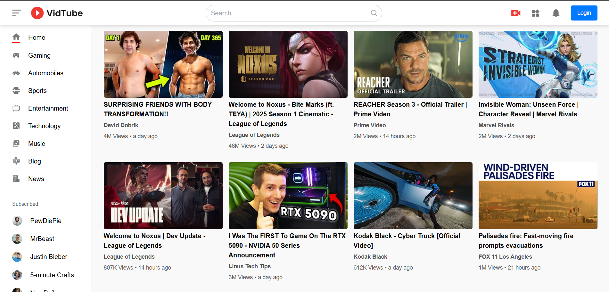
   - YouTube-like header and sidebar (toggleable from the hamburger menu). 
    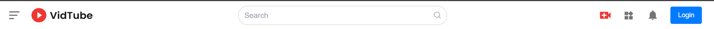
    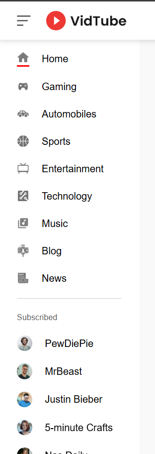
   - Video grid with thumbnails displaying video title, channel name, and views.
    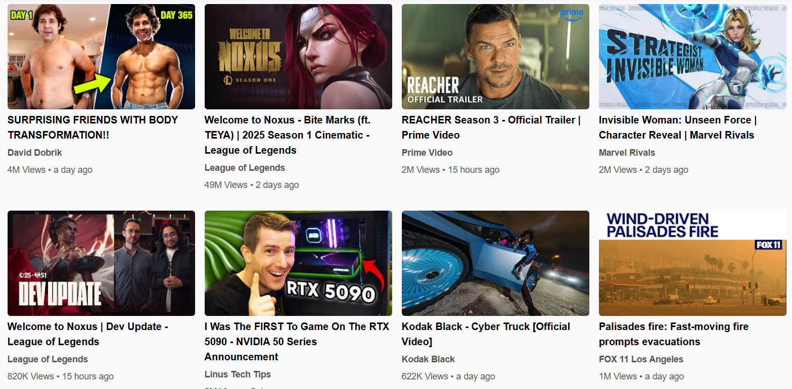
   - Filter buttons to sort videos by category. 
    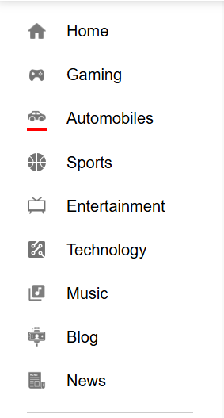


   - Search functionality to find videos by title. 
    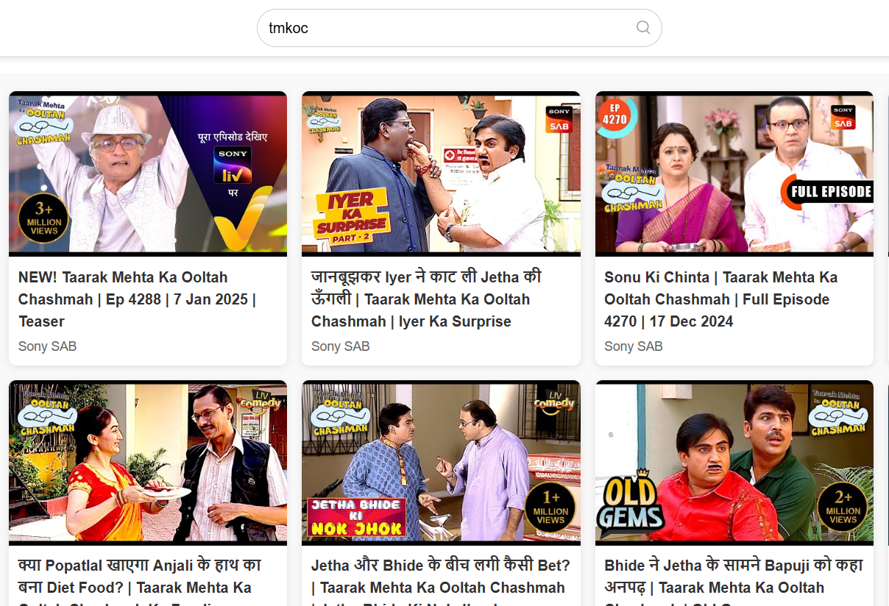


2. **User Authentication**  
   - Registration and login using email, username, and password. 
    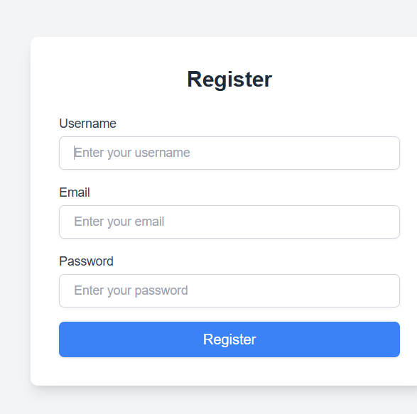
    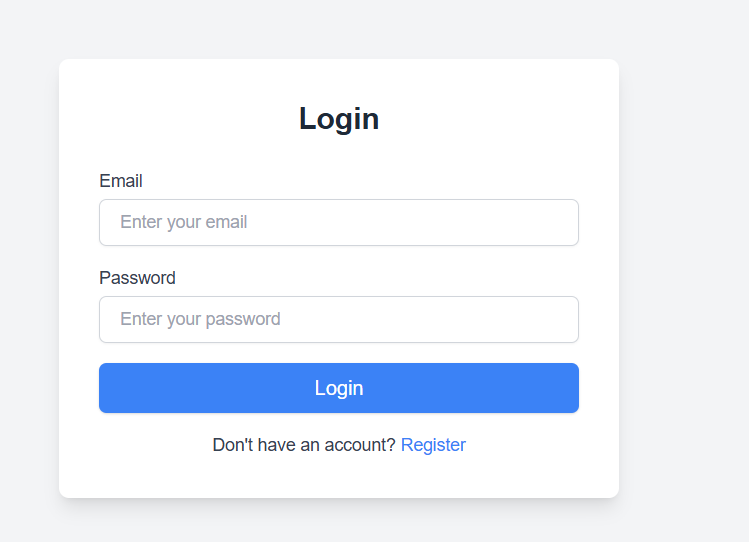
   - JWT-based authentication.  
   
3. **Video Player Page**  
   - Watch videos with a functional video player. 
   - Display video title, description, and uploader details.  
   - Like/Dislike functionality.  
   - Comment section with the ability to add, edit, and delete comments.  
    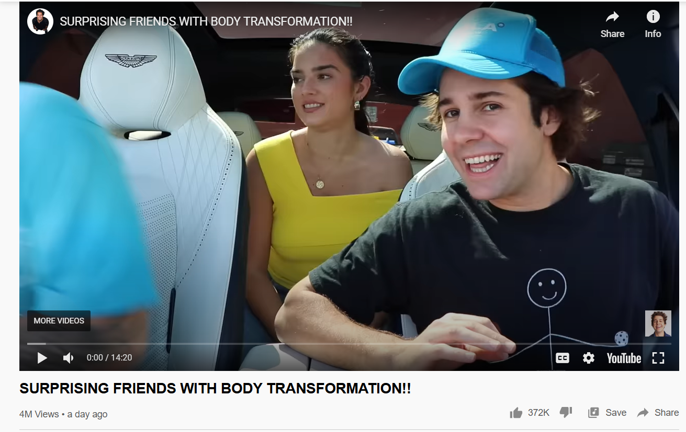
    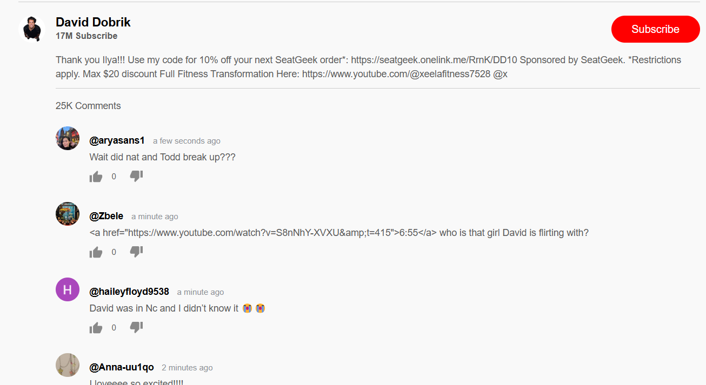


4. **Channel Page**  
   - Create and manage personal channels (only available to signed-in users).  
    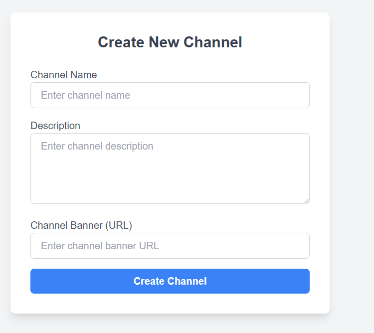
    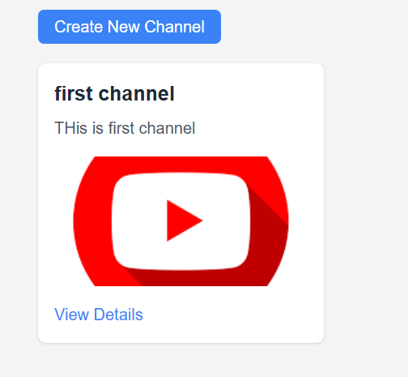
    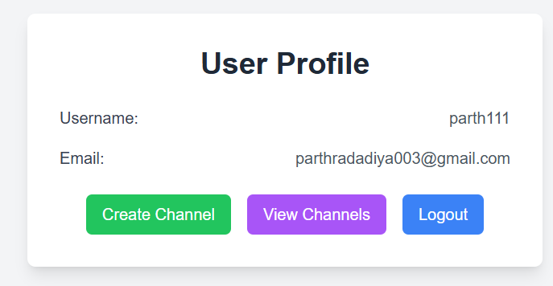

   - View all videos uploaded by the channel.
    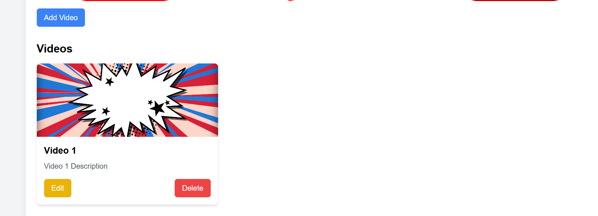
    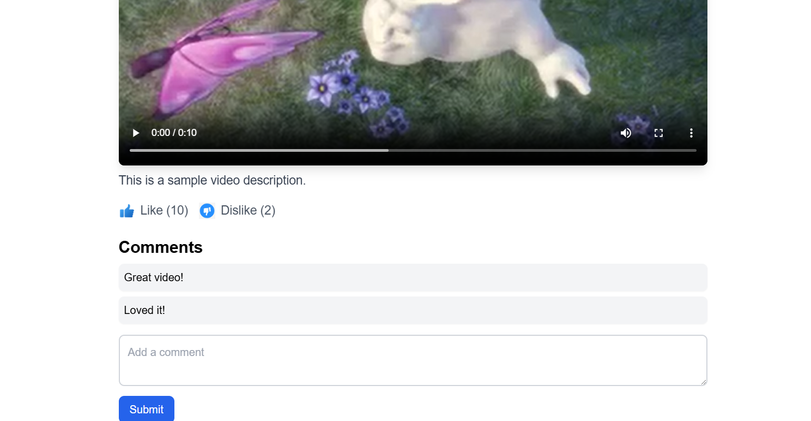
   - Edit or delete videos.  


5. **Responsive Design**  
   - Fully responsive UI for mobile, tablet, and desktop devices.  

---

### Backend
1. **API Endpoints**  
   - **User Authentication**: Sign up, login, and token-based authentication.  
   - **Channel Management**: Create channels, fetch channel data.  
   - **Video Management**: Fetch, update, and delete videos.  
   - **Comments**: Add, fetch, edit, and delete comments.  

2. **Database**  
   - MongoDB is used to store user data, video metadata, comments, and channel details.  

3. **Security**  
   - Secure JWT-based authentication for protected routes and actions.  

---

## Technologies Used

### Frontend
- **React.js** for building the user interface.  
- **React Router** for navigation and routing.  
- **Axios** for making HTTP requests.  

### Backend
- **Node.js** and **Express.js** for building APIs.  
- **MongoDB** (local instance or MongoDB Atlas) for database management.  

### Other Tools
- **JWT** for authentication.  
- **Git** for version control. 

### Screenshot
- *Channel* 
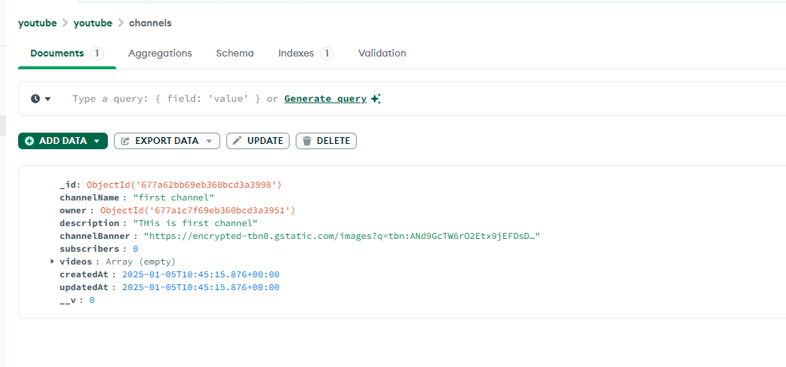
- *Comments* 
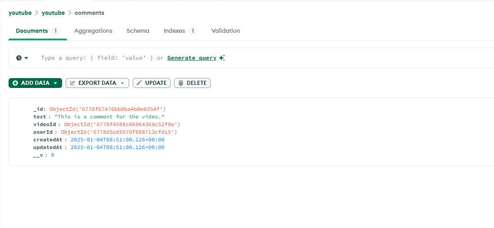
- *users* 
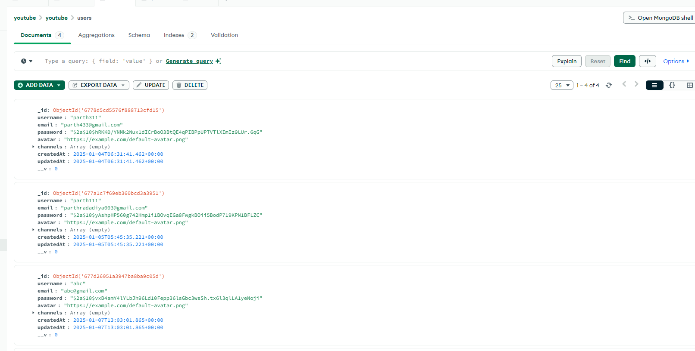
- *videos* 
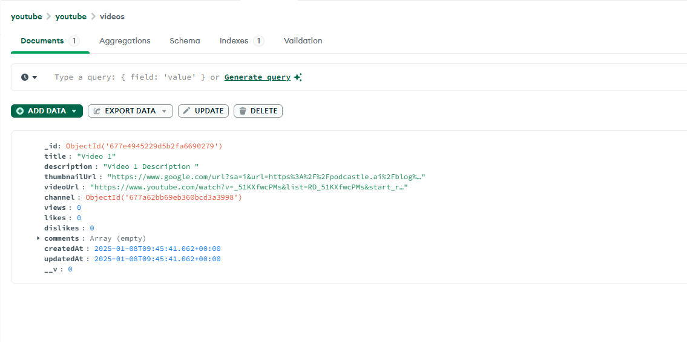

---

## Installation

### Prerequisites
- Node.js and npm installed.  
- MongoDB (local).  
- Git.  

### Steps
1. Clone the repository:  
   ```bash
   git clone https://github.com/parthu311/Youtube-Clone-MERN
   ```
2. Navigate to the project directory:  
   ```bash
   cd youtube-clone
   ```
3. Install dependencies for the backend:  
   ```bash
   cd backend
   npm install
   ```
4. Set up environment variables for the backend (e.g., `JWT_SECRET`, `MONGO_URI`) in a `.env` file.  
5. Start the backend server:  
   ```bash
   nodemon server.js
   ```
6. Install dependencies for the frontend:  
   ```bash
   cd ../frontend
   npm install
   ```
7. Start the frontend development server:  
   ```bash
   npm run dev
   ```

---

## Usage

1. Open the application in your browser at `http://localhost:5000`.  
2. Register or log in to access personalized features like creating channels, uploading videos, and commenting.  
3. Use the search bar or filters to browse videos.  
4. Click on a video to view its details and interact with it (like, dislike, comment).  

---


## Future Scope

---

## License

This project is licensed under the [MIT License](LICENSE).

---

## Contribution

Contributions are welcome! Please fork the repository and submit a pull request for any improvements or bug fixes.

--- 
Here's a detailed **README.md** file tailored for your backend project based on the folder structure and the assumed functionality:

---

# Video Streaming Backend

This is the backend for a video streaming platform, providing RESTful APIs for user authentication, video management, channels, and comments.

## Features

- **User Authentication**: User login, registration, and JWT-based authentication.
- **Video Management**: Create, fetch, update, and delete videos.
- **Channel Management**: Manage video channels.
- **Comments**: Add, delete, and fetch comments on videos.
- **Error Handling**: Centralized error handling for consistent API responses.

---

## Project Structure

```
.
├── config/
│   ├── db.js            # MongoDB connection setup
│   ├── jwt.js           # Utility functions for JWT
├── controllers/
│   ├── authController.js    # Handles user authentication logic
│   ├── channelController.js # Manages channel operations
│   ├── commentController.js # Handles comment-related functionality
│   ├── videoController.js   # Manages video CRUD operations
├── middlewares/
│   ├── authMiddleware.js    # Authentication middleware for protected routes
│   ├── errorHandler.js      # Centralized error handling
├── models/
│   ├── Channel.js           # Mongoose schema for channels
│   ├── Comment.js           # Mongoose schema for comments
│   ├── User.js              # Mongoose schema for users
│   ├── Video.js             # Mongoose schema for videos
├── routes/
│   ├── authRoutes.js        # Routes for user authentication
│   ├── channelRoutes.js     # Routes for channel management
│   ├── commentRoutes.js     # Routes for managing comments
│   ├── videoRoutes.js       # Routes for video operations
├── utils/
│   ├── ...                  # Utility functions (if any)
├── .env                     # Environment variables
├── .gitignore               # Ignored files for Git
├── app.js                   # Main application entry point
├── package.json             # Project dependencies and scripts
├── server.js                # Starts the server
```

---

## Prerequisites

- **Node.js** 
- **MongoDB** (local or cloud-based, e.g., MongoDB Atlas)

---

## Installation

1. **Clone the Repository**
   ```bash
   git clone https://github.com/parthu311/Youtube-Clone-MERN
   cd baackend
   ```

2. **Install Dependencies**
   ```bash
   npm install
   ```

3. **Set Up Environment Variables**
   Create a `.env` file in the root directory and add the following variables:
   ```env
   PORT=5000
   MONGO_URI=mongodb+srv://<username>:<password>@cluster.mongodb.net/<dbname>
   JWT_SECRET=your_jwt_secret
   ```

4. **Run the Application**
   ```bash
   npm start
   ```

---

## API Endpoints

### Authentication Routes (`authRoutes.js`)

| Method | Endpoint       | Description                  |
|--------|----------------|------------------------------|
| POST   | `/api/auth/register` | Register a new user       |
| POST   | `/api/auth/login`    | Login and generate a JWT  |

### Video Routes (`videoRoutes.js`)

| Method | Endpoint            | Description               |
|--------|---------------------|---------------------------|
| GET    | `/api/videos`       | Get all videos            |
| GET    | `/api/videos/:id`   | Get video by ID           |
| POST   | `/api/videos`       | Create a new video        |
| PUT    | `/api/videos/:id`   | Update video details      |
| DELETE | `/api/videos/:id`   | Delete a video            |

### Channel Routes (`channelRoutes.js`)

| Method | Endpoint                | Description                   |
|--------|-------------------------|-------------------------------|
| GET    | `/api/channels`         | Get all channels              |
| POST   | `/api/channels`         | Create a new channel          |
| DELETE | `/api/channels/:id`     | Delete a channel              |

### Comment Routes (`commentRoutes.js`)

| Method | Endpoint                        | Description                     |
|--------|---------------------------------|---------------------------------|
| GET    | `/api/comments/:videoId`        | Get comments for a video        |
| POST   | `/api/comments/:videoId`        | Add a comment to a video        |
| DELETE | `/api/comments/:id`             | Delete a comment                |

---

## Middleware

- **Authentication Middleware (`authMiddleware.js`)**: Protects routes that require user authentication.
- **Error Handler (`errorHandler.js`)**: Handles API errors and sends a standardized response.

---

## Scripts

- **Start the Server**: `nodemon server.js`
- **Run in Development Mode**: `npm run dev` (requires `nodemon`)

---

## Technologies Used

- **Backend**: Node.js, Express.js
- **Database**: MongoDB (via Mongoose)
- **Authentication**: JWT (JSON Web Tokens)

---
